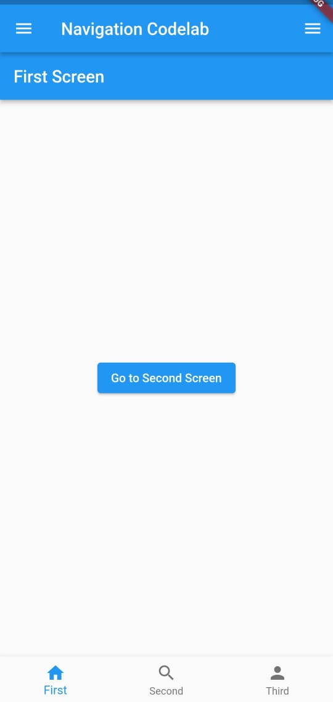

# navigation_codelab

## Instructions:
- Buka terminal anda lalu clone git repository ini:

  ```sh
  git clone https://github.com/HenryBS18/visual-programming-navigation.git
  ```

- lalu masuk ke folder visual-programming-navigation:
  ```sh
  cd visual-programming-navigation/
  ```

- jalankan code dibawah ini untuk meng-install dependency
  ```sh
  flutter pub get
  ```

- jalankan aplikasi:
  ```sh
  flutter run
  ```

## Description:
Ini adalah tampilan awal aplikasi ketika baru pertama dibuka:


Terdapat App Drawer pada bagian kiri atas aplikasi dan Bottom Navigation Bar pada bagian bawah aplikasi.

<br>

Ini adalah tampilan App Drawer jika ditekan:
